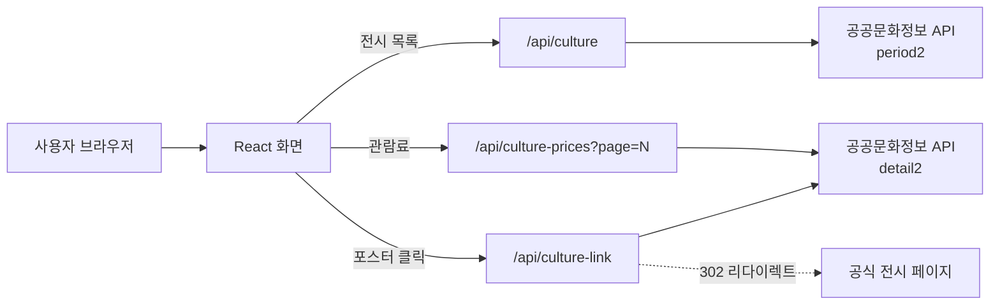

# 전시갈래

공공문화정보를 활용해 지금 관람할 수 있는 전시를 찾고, 가고 싶은 전시를 모아 둘 수 있도록 만든 React 기반 전시 탐색 웹 서비스입니다.

> 가려던 전시를 놓치지 않도록, 곧 끝나는 전시와 새로 시작한 전시를 먼저 보여주고 지역·기간·주말 관람 여부로 빠르게 좁혀 볼 수 있게 만들었습니다.

## 1. Links

- **배포 사이트:** https://jeonsi-gallae.vercel.app/
- **GitHub:** https://github.com/yeonland/jeonsi-gallae

## 2. 프로젝트 배경

전시 정보는 여러 기관과 예매처에 흩어져 있어, 가 보고 싶은 전시를 찾거나 언제까지 하는지 확인하려면 여러 페이지를 반복해서 확인해야 합니다. 전시갈래는 공공데이터에서 진행 중·예정 전시를 불러와 같은 형식으로 보여주고, 마음에 드는 전시를 찜해 두었다가 공식 페이지로 바로 이동할 수 있도록 기획했습니다.

## 3. 핵심 기능

| 기능 | 내용 |
| --- | --- |
| 전시 데이터 조회 | 공공문화정보 API에서 오늘 이후 진행 중·예정인 전시를 모두 불러옵니다. |
| 추천순 정렬 | 곧 종료(14일 이내) → 최근 시작(30일 이내) → 그 외 진행 중 → 예정 순으로 보여줍니다. 마감 임박순·최근 시작순·이름순도 선택할 수 있습니다. |
| 검색 | 전시명·기관명·지역·시군구로 실시간 검색합니다. |
| 필터 | 전시 중 / 곧 종료 / 전시 예정 / 이번 주말 관람 가능 / 무료, 관람일 선택, 지역별 필터를 제공합니다. |
| 관람료 표시 | 상세 API에서 모은 관람료를 카드에 표시하고, 무료 전시는 강조합니다. |
| 관람 상태 표시 | 전시 예정·전시 중·전시 종료 상태와 종료 임박 전시의 D-day를 표시합니다. |
| 찜한 전시 | 하트를 눌러 전시를 찜하고, 찜한 전시 탭에서 모아 봅니다. 브라우저(localStorage)에 저장되어 새로고침해도 유지됩니다. |
| 공식 페이지 연결 | 포스터나 제목을 누르면 상세 API로 찾은 공식 전시 페이지가 새 창으로 열립니다. |
| 더보기 | 12개씩 보여주고 더보기 버튼으로 이어서 불러옵니다. |
| 반응형 화면 | 데스크톱 4열 → 태블릿 3·2열 → 모바일 리스트형 카드로 전환됩니다. |

## 4. 데이터 처리 구조



- 브라우저가 공공 API를 직접 호출하면 서비스 키가 노출되므로, 프런트엔드는 Vercel Function(`/api/*`)만 호출하고 함수가 서버 환경변수 `CULTURE_API_KEY`로 공공 API에 요청합니다.
- 목록 응답은 1시간, 상세 링크는 하루, 관람료는 12시간 동안 Vercel CDN에 캐시해 API 호출 수를 줄였습니다.

## 5. 기술 스택

| 구분 | 사용 기술 |
| --- | --- |
| Frontend | React 19, JavaScript, CSS |
| Build | Vite |
| Data | 공공문화정보 API(한국문화정보원 한눈에보는문화정보조회서비스), XML |
| Serverless | Vercel Functions |
| Deployment | Vercel, GitHub |
| Code Quality | ESLint |

## 6. 폴더 구조

```text
jeonsi-gallae/
├─ api/
│  ├─ _lib/culture.js         # 공용 모듈 (요청 URL, 요청 제한 재시도)
│  ├─ culture.js              # 전시 목록 조회 서버리스 함수
│  ├─ culture-link.js         # 상세 API로 공식 페이지를 찾아 리다이렉트
│  └─ culture-prices.js       # 관람료를 30개씩 나눠 수집
├─ public/                    # 정적 파일
├─ src/
│  ├─ api/
│  │  └─ cultureApi.js        # XML 파싱 및 전시 데이터 변환
│  ├─ components/
│  │  └─ ExhibitionCard.jsx   # 전시 카드 (포스터 링크, 찜 버튼, D-day)
│  ├─ data/
│  │  └─ exhibitions.js       # 초기 목업 데이터
│  ├─ hooks/
│  │  └─ useFavorites.js      # 찜한 전시 localStorage 저장
│  ├─ utils/
│  │  ├─ exhibitionFilters.js # 검색·필터·정렬·주말 계산
│  │  └─ getExhibitionStatus.js
│  ├─ App.css
│  ├─ App.jsx
│  ├─ index.css
│  └─ main.jsx
├─ .env.example
├─ .gitignore
├─ package.json
├─ vercel.json                # 관람료 함수 실행 시간 설정
└─ vite.config.js             # 개발 서버 /api 프록시 설정
```

## 7. 실행 방법

### ① 저장소 복제 및 패키지 설치

```bash
git clone https://github.com/yeonland/jeonsi-gallae.git
cd jeonsi-gallae
npm install
```

### ② 환경변수 설정

프로젝트 최상단에 `.env.local` 파일을 만들고 발급받은 키를 입력합니다. `.env.local`은 Git에 업로드하지 않습니다.

```env
CULTURE_API_KEY=발급받은_API_키
```

### ③ 개발 환경 실행

```bash
npm run dev
```

Vite 개발 서버는 Vercel Function을 실행하지 않으므로, `vite.config.js`의 프록시 설정으로 `/api` 요청을 배포된 사이트로 넘겨 실제 데이터를 받아옵니다. 화면 작업은 이 방법으로 충분합니다.

`api/` 폴더의 서버리스 함수를 수정했다면 Vercel CLI로 로컬에서 함께 실행해 확인합니다.

```bash
npx vercel dev
```

### ④ 빌드 및 린트

```bash
npm run build
npm run lint
```

## 8. 구현 현황

### 구현 완료

- 공공문화정보 API에서 오늘 이후 진행 중·예정 전시 전체 조회
- XML 응답 파싱 및 화면에 필요한 데이터 형태로 변환, 지역 표기 통일
- 추천순(곧 종료 → 최근 시작 → 진행 중 → 예정) 및 마감 임박순·최근 시작순·이름순 정렬
- 전시명·기관명·지역·시군구 실시간 검색
- 전시 중 / 곧 종료 / 전시 예정 / 이번 주말 관람 가능 / 무료 필터, 관람일 선택 필터, 지역 필터, 필터 초기화
- 카드에 관람료 표시 (무료 강조)
- 검색 버튼을 누르면 결과 목록으로 이동
- 전시 상태 배지와 종료 임박 D-day 표시
- 찜하기 및 찜한 전시 탭 (localStorage 저장)
- 포스터·제목 클릭 시 공식 전시 페이지로 이동 (상세 링크가 없으면 검색 결과로 대체)
- 12개씩 보여주는 더보기 버튼
- 데스크톱·태블릿·모바일 반응형 레이아웃
- 로딩, 오류, 검색 결과 없음, 찜 목록 비어 있음 안내
- Vercel Functions와 환경변수를 이용한 API 키 비공개 처리, CDN 캐시
- Vercel 배포 및 GitHub `main` 브랜치 자동 배포 연결

### 향후 구현

- 지도에서 전시 위치 보기 (API의 좌표 활용)
- 국립지방박물관 등 다른 공공 전시 데이터 통합

## 9. 문제 해결

### API 키 노출 위험

- **문제:** 클라이언트 코드에서 공공 API를 직접 요청하면 API 키가 브라우저에 노출될 수 있었습니다.
- **개선:** `/api/culture` Vercel Function을 만들고 API 키를 Vercel 환경변수로 이동했습니다.
- **결과:** 브라우저에는 실제 API 키가 포함되지 않고, 서버 함수가 대신 공공 API와 통신합니다.

### 전시가 일부만 조회되던 문제

- **문제:** 올해 1~12월 기간으로 첫 페이지 100건만 요청하고 있었는데, 실제 데이터는 12,000건이 넘고 공연과 전시가 섞여 있어 화면에는 종료된 전시를 포함해 89개만 나왔습니다.
- **원인 분석:** API를 직접 호출해 보며 `from`/`to`가 "시작일 또는 종료일이 기간 안에 있는 항목"을 반환하고, 분야·지역 파라미터는 결과에 영향을 주지 않는다는 것을 확인했습니다.
- **개선:** 조회 기간을 `오늘 ~ 2099년`으로 바꾸고 한 번에 1,000건까지 받도록 수정했습니다.
- **결과:** 진행 중·예정 전시만 273개(수정 시점 기준)로 늘었고, 종료된 전시는 목록에서 빠졌습니다.

### 목록 API에 상세 링크가 없는 문제

- **문제:** 목록 API에는 공식 페이지 주소가 없고, 전시마다 상세 API를 미리 호출하면 호출 수가 너무 많아졌습니다.
- **개선:** 포스터 링크를 `/api/culture-link?seq=…`로 연결해, 사용자가 누를 때만 상세 API를 호출하고 공식 페이지로 302 리다이렉트하도록 만들었습니다. 링크가 없으면 장소 페이지나 검색 결과로 대체합니다.
- **결과:** 일반 `<a>` 링크라서 새 창 열기·접근성이 그대로 유지되고, 결과는 하루 동안 캐시됩니다.

### 관람료 수집 시 요청 제한 문제

- **문제:** 무료 필터를 만들려면 전시마다 상세 API를 호출해야 했는데, 270여 건을 동시에 요청하자 대부분 `초당 서비스 요청제한 횟수 초과` 오류가 돌아왔습니다.
- **개선:** 한 건씩 간격을 두고 요청하고, 제한에 걸리면 잠시 쉬었다가 다시 요청하도록 했습니다. 한 번에 다 모으면 함수 실행 시간이 너무 길어져 30개씩 페이지로 나누고, 페이지별 결과를 12시간 동안 캐시했습니다.
- **결과:** 화면은 목록을 먼저 보여주고 관람료는 뒤에서 이어 받아 합칩니다. 캐시된 뒤에는 페이지당 0.3초 안에 응답합니다.

### `npm run dev`에서 전시가 보이지 않던 문제

- **문제:** Vite 개발 서버가 `/api/culture` 요청에 서버리스 함수 결과 대신 소스 코드를 200으로 돌려줘, 오류 없이 빈 목록만 보였습니다.
- **개선:** `vite.config.js`에 `/api` 프록시를 추가해 개발 중에는 배포된 함수를 사용하도록 했고, 결과가 없을 때 안내 문구를 표시했습니다.

### XML 데이터의 화면 출력

- **문제:** API가 반환하는 XML을 React 화면에서 바로 사용하기 어려웠고, 일부 문자열에는 HTML 인코딩이 중복 적용되어 있었습니다.
- **개선:** `DOMParser`로 XML을 파싱하고, 필요한 항목만 객체로 변환했으며 중복 인코딩을 해제하는 함수를 추가했습니다.
- **결과:** 제목, 기관, 지역, 기간과 이미지 정보를 일정한 카드 형식으로 출력할 수 있게 됐습니다.

### 모바일에서 필터 영역이 화면 밖으로 넘치던 문제

- **문제:** 모바일에서 필터 칩을 가로 스크롤로 바꾸자 지역·정렬 선택 상자가 화면 오른쪽으로 넘쳤습니다.
- **원인:** `flex-direction: column`에 `flex-wrap: wrap`이 함께 있으면, 줄의 너비가 가장 긴 자식(필터 칩 한 줄)에 맞춰 늘어났습니다.
- **개선:** 모바일 구간에서 `flex-wrap: nowrap`으로 바꿔 컨테이너 너비를 화면 폭에 맞췄습니다.

## 10. 현재 한계

- 관람료는 12시간마다 갱신되며, 캐시가 비어 있으면 처음 불러올 때 시간이 걸립니다.
- 관람료는 기관이 입력한 문구를 그대로 쓰므로, `무료`로 시작하는 경우만 무료 전시로 분류합니다.
- 찜한 전시는 브라우저에 저장되므로 다른 기기와 공유되지 않습니다.
- 진행 중·예정 데이터가 1,000건을 넘으면 페이지를 나눠 받는 처리가 추가로 필요합니다.
- API 제공 상태와 데이터 품질에 따라 일부 정보나 이미지가 누락될 수 있습니다.

## 11. 검증 결과

- `npm run build`: 통과
- `npm run lint`: 통과 (`api/` 폴더에 Node.js 전역 변수 환경을 지정해 기존 `process` 오류 해결)
- 화면 폭 1440px·768px·375px·320px에서 레이아웃 확인

## 12. 회고

이 프로젝트를 통해 React에서 외부 데이터를 상태로 관리하고, XML 응답을 화면에 필요한 형태로 가공하는 흐름을 경험했습니다. 특히 전시가 적게 나오던 문제를 다른 데이터를 찾기 전에 API를 직접 호출해 파라미터 동작부터 확인하면서, 문제의 원인이 데이터가 아니라 요청 방식에 있었다는 것을 알게 됐습니다. 또 상세 링크처럼 비용이 큰 요청은 사용자가 필요할 때만 호출하고 캐시하는 구조로 바꾸면서, 기능뿐 아니라 API 호출 비용과 보안까지 함께 고려하게 됐습니다.
