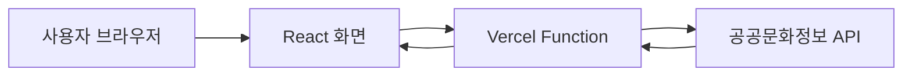

# 전시갈래

공공문화정보를 활용해 현재 관람할 수 있는 전시를 한 화면에서 찾고 비교할 수 있도록 만든 React 기반 전시 탐색 웹 서비스입니다.

> 지역과 날짜를 살펴보며 이번 주말에 갈 만한 전시를 빠르게 찾는 경험을 목표로 제작했습니다.

## 1. Links

- **배포 사이트:** https://jeonsi-gallae.vercel.app/
- **GitHub:** https://github.com/yeonland/jeonsi-gallae

## 2. 프로젝트 배경

전시 정보는 여러 기관과 예매처에 흩어져 있어, 사용자가 지금 관람 가능한 전시를 찾으려면 여러 페이지를 반복해서 확인해야 합니다. 전시갈래는 공공데이터에서 전시 정보를 불러와 제목, 기관, 지역, 분야, 기간과 진행 상태를 같은 형식으로 제공하고, 사용자가 관심 있는 전시를 빠르게 탐색할 수 있도록 기획했습니다.

## 3. 핵심기능

| 기능 | 내용 |
| --- | --- |
| 전시 데이터 조회 | 공공문화정보 API에서 전시 데이터를 불러와 화면에 표시합니다. |
| 실시간 검색 | 전시명·기관명·지역·분야를 기준으로 전시를 검색합니다. |
| 관람 상태 표시 | 시작일과 종료일을 비교해 전시 예정·전시 중·전시 종료 상태를 구분합니다. |
| 전시 카드 제공 | 포스터·기관·기간·지역·분야 정보를 동일한 카드 형식으로 제공합니다. |

## 4. 데이터 처리 구조



브라우저가 공공 API를 직접 호출하면 서비스 키가 클라이언트 코드에 노출될 수 있습니다. 이를 방지하기 위해 프런트엔드는 `/api/culture`만 호출하고, Vercel Function이 서버 환경변수의 `CULTURE_API_KEY`를 사용해 공공 API에 요청하도록 구성했습니다.

## 5. 기술 스택

| 구분 | 사용 기술 |
| --- | --- |
| Frontend | React 19, JavaScript, CSS |
| Build | Vite |
| Data | 공공문화정보 API, XML |
| Serverless | Vercel Functions |
| Deployment | Vercel, GitHub |
| Code Quality | ESLint |

## 6. 폴더 구조

```text
jeonsi-gallae/
├─ api/
│  └─ culture.js              # 공공 API를 호출하는 서버리스 함수
├─ public/                    # 정적 파일
├─ src/
│  ├─ api/
│  │  └─ cultureApi.js        # XML 파싱 및 전시 데이터 변환
│  ├─ components/
│  │  └─ ExhibitionCard.jsx   # 전시 카드 컴포넌트
│  ├─ data/
│  │  └─ exhibitions.js       # 초기 목업 데이터
│  ├─ utils/
│  │  └─ getExhibitionStatus.js
│  ├─ App.css
│  ├─ App.jsx
│  ├─ index.css
│  └─ main.jsx
├─ .env.example
├─ .gitignore
├─ package.json
└─ vite.config.js
```

## 7. 실행 방법

### ① 저장소 복제 및 패키지 설치

```bash
git clone https://github.com/yeonland/jeonsi-gallae.git
cd jeonsi-gallae
npm install
```

### ② 환경변수 설정

프로젝트 최상단에 `.env.local` 파일을 만들고 발급받은 키를 입력합니다.

```env
CULTURE_API_KEY=발급받은_API_키
```

`.env.local`은 Git에 업로드하지 않습니다.

### ③ 개발 환경 실행

화면 작업만 확인할 때는 다음 명령어를 사용할 수 있습니다.

```bash
npm run dev
```

Vercel Function과 실제 API 요청까지 함께 확인하려면 Vercel CLI로 프로젝트를 연결한 후 실행합니다.

```bash
npx vercel dev
```

### ④ 빌드 확인

```bash
npm run build
```

## 8. 구현 현황
### 구현 완료

- 공공문화정보 API의 전시 데이터 조회
- XML 응답 파싱 및 화면에 필요한 데이터 형태로 변환
- 전시명, 기관명, 지역, 분야를 기준으로 한 실시간 검색
- 시작일과 종료일을 비교한 `전시 예정`, `전시 중`, `전시 종료` 상태 표시
- 포스터, 기관, 기간, 지역, 분야를 카드 형식으로 제공
- API 요청 중 로딩 안내 및 실패 시 오류 메시지 표시
- Vercel Functions와 환경변수를 이용한 API 키 비공개 처리
- Vercel 배포 및 GitHub `main` 브랜치 자동 배포 연결

### 향후 구현

- 이번 주말, 서울, 무료 전시, 전시 중 빠른 필터
- 찜한 전시 저장 및 목록 조회
- 전시 상세정보와 공식 예매처 연결
- 지역·날짜별 상세 필터
- 검색 결과가 없을 때 별도 안내
- 모바일 화면과 접근성 보완

## 9. 문제 해결

### API 키 노출 위험

- **문제:** 클라이언트 코드에서 공공 API를 직접 요청하면 API 키가 브라우저에 노출될 수 있었습니다.
- **개선:** `/api/culture` Vercel Function을 만들고 API 키를 Vercel 환경변수로 이동했습니다.
- **결과:** 브라우저에는 실제 API 키가 포함되지 않고, 서버 함수가 대신 공공 API와 통신하도록 변경했습니다.

### XML 데이터의 화면 출력

- **문제:** API가 반환하는 XML을 React 화면에서 바로 사용하기 어려웠고, 일부 문자열에는 HTML 인코딩이 중복 적용되어 있었습니다.
- **개선:** `DOMParser`로 XML을 파싱하고, 필요한 항목만 객체로 변환했으며 중복 인코딩을 해제하는 함수를 추가했습니다.
- **결과:** 제목, 기관, 지역, 분야, 기간과 이미지 정보를 일정한 카드 형식으로 출력할 수 있게 됐습니다.

### 전시 진행 상태 구분

- **문제:** 날짜만으로는 사용자가 현재 관람 가능한 전시인지 빠르게 판단하기 어려웠습니다.
- **개선:** 현재 날짜와 시작일·종료일을 비교하는 유틸리티 함수를 분리했습니다.
- **결과:** 각 카드에서 전시 예정, 전시 중, 전시 종료 상태를 바로 확인할 수 있게 됐습니다.

## 10. 현재 한계

- 공공 API에서 제공하지 않는 가격은 `가격 확인`으로 표시합니다.
- 빠른 필터와 찜하기 버튼은 현재 UI만 구현된 상태입니다.
- 한 번에 최대 100개의 데이터를 조회하며 페이지네이션은 적용하지 않았습니다.
- 전시 상세페이지와 공식 예매처 연결은 추가 구현이 필요합니다.
- API 제공 상태와 데이터 품질에 따라 일부 정보나 이미지가 누락될 수 있습니다.

## 11. 검증 결과

- `npm run build`: 통과
- `npm run lint`: `api/culture.js`의 Node.js 전역 변수 `process`를 ESLint 환경에 등록하지 않아 1건 발생

현재 린트 오류는 배포 기능의 오류가 아니라 클라이언트와 서버리스 함수가 함께 있는 프로젝트에서 ESLint 실행 환경을 구분하지 않은 설정 문제입니다.

## 12. 회고

이 프로젝트를 통해 React에서 외부 데이터를 상태로 관리하고, XML 응답을 화면에 필요한 형태로 가공하는 흐름을 경험했습니다. 특히 기능 구현뿐 아니라 API 키가 브라우저에 노출되지 않도록 서버리스 함수와 환경변수 구조로 개선하면서 배포 환경의 보안까지 함께 고려하게 됐습니다. 앞으로 빠른 필터와 찜하기 기능을 실제 동작으로 연결하고, 상세 탐색과 반응형 화면을 보완할 계획입니다.
